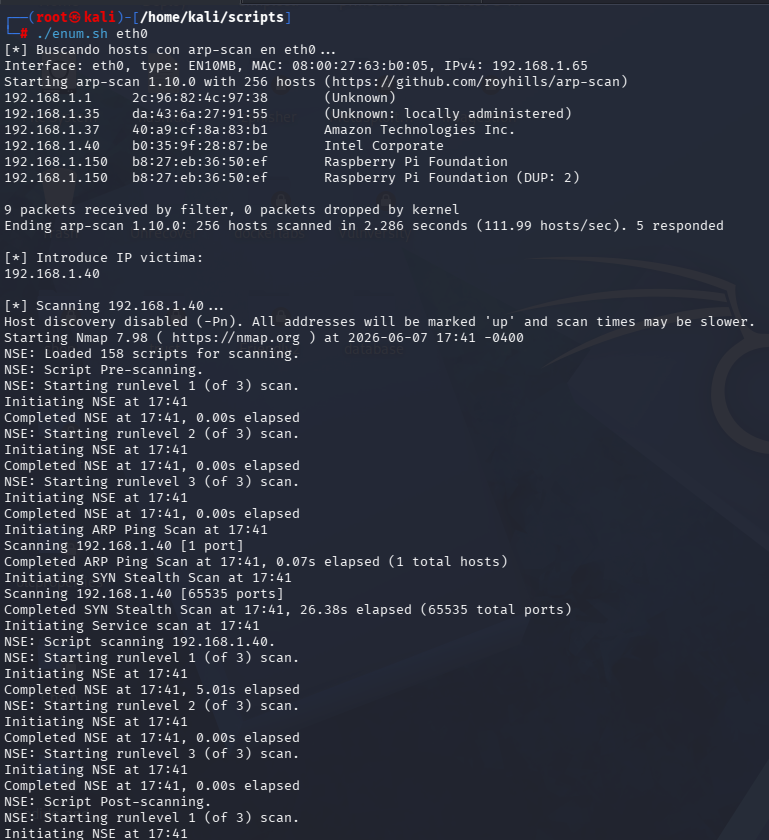

Script de reconocimiento para entornos de laboratorio.
Automatiza la enumeración de hosts con arp-scan y escaneo de puertos con nmap.

## Dependencies
- arp-scan
- nmap
- sudo
## Uso
```bash
sudo ./enum.sh <interfaz-de-red> 
```


## Permisos
Le damos permiso de ejecución al script:
```bash
chmod +x enum.sh
```
**INTERFACE=$1** recoge el primer argumento pasado al script. En este caso es el nombre de la interfaz.

Si la interfaz está vacía devolvemos ejemplo de uso.

Ejecutamos arp-scan con la tarjeta introducida.

Introducimos la IP víctima y ejecutamos escaneo con NMAP.
```txt
-p- = escanea todos los puertos por defecto (65535)
--open = devuelve solo puertos con estado OPEN
-sS = escaneto TCP Syn Port (escaneo sigiloso)
-sC = ejecuta scripts básicos de NMAP
-sV = obtiene versión de servicios encontrados
--min-rate 5000 = envía 5000 paquetes por segundo
-n = no realiza resolución DNS
-vvv = reporta información conforme la obtiene
-Pn = no realiza reconocimiento ICMP
-oN = exporta resultados a un archivo
```
